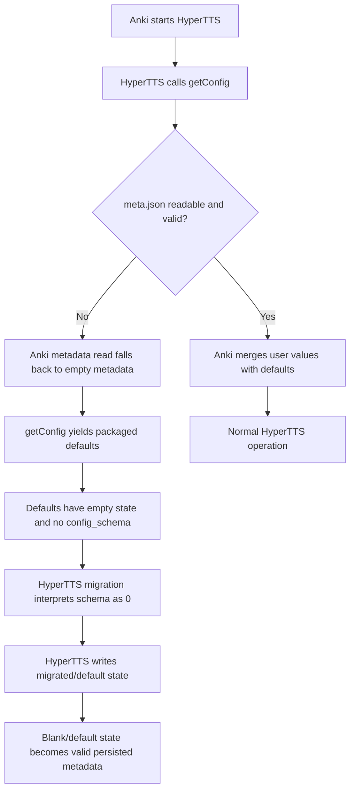
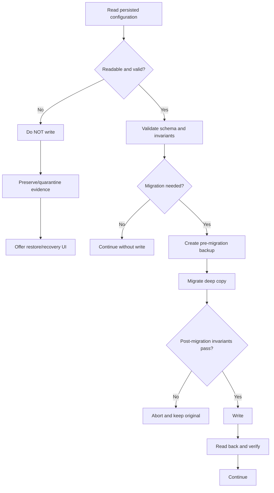

# Anki Add-on Configuration Loss: HyperTTS Issue #360 and the Wider Persistence Failure Landscape

## Executive summary

The evidence supports a distinction between **three different classes of “configuration loss”** that users tend to report under the same label: genuine on-disk state loss, settings that still exist but become inaccessible after an add-on or Anki change, and settings that are overwritten because an add-on uses the wrong persistence layer or stale in-memory state. The HyperTTS report in issue #360 is consistent with the first class—users repeatedly losing API-key settings and, according to AnkiWeb reviews quoted by the maintainer, presets—but the issue currently contains no reproduction case, affected Anki version, operating system, damaged configuration file, log, attachment, or linked fix. It remains open as of August 15, 2026, labeled both “need reproduction” and as a priority for an upcoming release. citeturn21view0

The most important technical finding is a **plausible destructive fallback/writeback chain in the current Anki + HyperTTS code**:

1. Anki stores add-on default configuration in `config.json`, but user modifications in the add-on's `meta.json`; `getConfig()` merges the two, preferring user values. citeturn28search0turn21view2
2. In current Anki source, `writeAddonMeta()` opens `meta.json` with mode `"w"` and then performs `json.dump()` directly. That means the existing file is truncated before serialization completes rather than being written to a temporary file and atomically replaced. The read path catches malformed JSON and other exceptions and falls back to empty metadata. citeturn11view2turn11view3
3. HyperTTS uses Anki's `getConfig()`/`writeConfig()` API, so its persisted configuration ultimately travels through this `meta.json` mechanism. citeturn16view0
4. HyperTTS's shipped `config.json` contains empty `configuration`, `presets`, `mapping_rules`, and related objects, but **does not contain a `config_schema` field**. citeturn19view0
5. HyperTTS currently defines schema version 4. Its migration function interprets a missing schema as version 0; for pre-v2 state it initializes the presets dictionary and migrates legacy batch configurations. citeturn20view0turn18view0
6. On initialization HyperTTS loads the configuration, runs migration, and writes the resulting configuration back. Its individual save methods likewise write the complete in-memory configuration dictionary. citeturn17view0turn17view1turn17view2

That combination creates a credible failure amplifier: **a transient `meta.json` read failure, deletion, malformed/truncated JSON, or equivalent “no user metadata” condition can cause Anki to return HyperTTS's empty defaults; HyperTTS can then treat them as old-schema state and persist them back as valid current configuration.** What began as a recoverable or transient read problem can thereby become durable loss of API keys and presets. This is an inference from the two projects' current code, not yet a demonstrated root cause of issue #360. citeturn11view0turn11view2turn19view0turn18view0turn17view0

A second credible HyperTTS-specific risk is **stale whole-object overwrite**. HyperTTS keeps a long-lived `self.config` object and its save operations mutate one part and then write the entire dictionary. If another route changes the underlying add-on metadata—a different settings UI, another process, profile transition logic, or direct use of Anki's Config editor—a later save from the stale object can restore old values over newer ones. The architecture makes this possible even though there is no proof yet that it is happening in #360. citeturn17view1turn17view2

The wider Anki ecosystem confirms that configuration problems are not hypothetical. Examples include an add-on that manually read `config.json` and wrote a separate `config_saved.json`, thereby bypassing Anki's `meta.json` behavior; an add-on whose custom controller controls disappeared after restart/update; Onigiri state resetting after a profile switch; an older Migaku add-on resetting when Anki exited; and AnkiMorphs discovering that standard add-on configuration was global rather than profile-specific. citeturn21view3turn22view0turn25view0turn25view1turn25view2

My priority recommendation is therefore **not** simply “add more logging.” HyperTTS should first make startup non-destructive: include the current schema in shipped defaults, do not write configuration on every startup unless a migration actually succeeded and changed verified state, treat missing/invalid persisted state as a recovery condition rather than permission to replace it, keep rolling non-secret backups under `user_files`, and reload/merge fresh state immediately before each settings mutation instead of persisting an old global snapshot. Anki itself would benefit from changing `writeAddonMeta()` to a temporary-file + flush/fsync + `os.replace()` pattern and from surfacing malformed metadata distinctly instead of reducing it to an empty configuration. Python documents `fsync()` for forcing buffered data to storage, and its file APIs provide `os.replace()` for replacement semantics. citeturn11view3turn28search1turn28search4

## HyperTTS issue #360: evidence, timeline, and code context

### What the issue actually establishes

Issue #360, **“Configuration not being saved; presets being deleted after updates,”** was opened by `luc-vocab` on July 3, 2026. The maintainer says “a number of people” have reported that HyperTTS does not retain its configuration and that users need to enter their API key repeatedly. The issue also reproduces two AnkiWeb-review complaints: “Addon frequently deletes presets.” and “buggy, for example doesn't save my settings”. citeturn21view0

As of August 15, 2026, the issue is still open. It is tagged `need reproduction` and `priority try to include this in next release`; there is no assignee, milestone, project association, relationship, linked branch, or pull request. The web-rendered issue exposes only the opening report and metadata; I found **no issue-specific diagnostic comments, logs, screenshots, configuration files, crash dumps, or other attachments**, and no proposed patch is linked from the issue. citeturn21view0

That makes the current evidentiary status unusually important:

| Date / stage | Evidence | What it tells us |
|---|---|---|
| Before July 3, 2026 | Multiple user reports/reviews, according to the maintainer | The symptom is not apparently a one-user event, but the reports are not normalized by Anki version, HyperTTS version, OS, update history, or exact loss event. citeturn21view0 |
| July 3, 2026 | Issue #360 opened | API keys repeatedly need re-entry; some users report deleted presets. citeturn21view0 |
| Issue triage | `need reproduction` | Maintainers have not established a reproducible trigger. citeturn21view0 |
| Priority assignment | “try to include this in next release” | The report is treated as significant, but this is prioritization rather than evidence of a root cause or fix. citeturn21view0 |
| August 15, 2026 | Open; no linked development | There is no publicly linked implementation fix on the issue page. citeturn21view0 |

### A related HyperTTS report should not be mistaken for the same bug

HyperTTS issue #157 from February 2024 is superficially similar but materially different. After upgrading to Anki Desktop 23.12.1 and HyperTTS 1.08, a user reported that nine presets appeared unavailable from the editor and HyperTTS warned there were no presets. Yet the same presets remained visible in HyperTTS settings and the configuration. The user disabled other add-ons and restarted without resolving the behavior. citeturn21view1

The corresponding Anki Forum discussion is especially revealing. The user initially interpreted a nearly blank `config.json` as evidence of loss, but an Anki contributor explained that this was expected: `config.json` carries defaults and users' modifications are stored in `meta.json`. The user subsequently said they had figured out what was actually wrong with HyperTTS and withdrew the configuration-loss interpretation. citeturn21view2

This gives #360 investigators an important diagnostic rule: **“preset missing from the UI” is not equivalent to “preset deleted from persisted state.”** Any new report should record all three independently:

| Layer | Question |
|---|---|
| UI | Is the preset/API key visible and selectable in every HyperTTS dialog that should expose it? |
| Logical config | What does `mw.addonManager.getConfig()` return at that instant? |
| Physical persistence | Is the expected value present in the add-on's `meta.json`, and is that file valid JSON? |

Issue #157 appears to have been an accessibility/mapping behavior rather than underlying deletion, whereas #360 explicitly reports repeated credential/configuration persistence failure and reviews alleging preset deletion. citeturn21view1turn21view2turn21view0

### What HyperTTS persists today

HyperTTS is not maintaining its main configuration in a private SQLite database or pickle file. Its Anki adapter calls `mw.addonManager.getConfig(...)` and `writeConfig(...)`, meaning the ordinary Anki add-on configuration system is the persistence mechanism. HyperTTS separately has a `user_files` location available to it, but the main settings path shown in current code uses the Anki API. citeturn16view0

Anki's official add-on documentation defines the relevant model clearly: developers ship default values in `config.json`; `getConfig()` retrieves configuration; `writeConfig()` persists programmatic changes; GUI-edited configuration is stored in `meta.json`; and `getConfig()` prefers user values from metadata while filling missing keys from defaults. The docs additionally warn that files outside an add-on's `user_files` directory may be replaced during add-on updates, while `user_files` is specifically preserved. citeturn28search0turn7search0

The shipped HyperTTS defaults are:

```json
{
  "configuration": {},
  "preferences": {},
  "presets": {},
  "mapping_rules": {},
  "batch_config": {},
  "realtime_config": {},
  "default_presets": {}
}
```

Notably, current defaults omit `config_schema`. citeturn19view0

HyperTTS's current constants define the schema field as `config_schema` and the current schema as version 4. citeturn20view0

That is significant because migration code defaults an absent schema to zero. In older-schema handling, it rebuilds the presets structure from the historical `batch_config` representation, and later migrations transform voices and remove obsolete properties before setting the current schema. citeturn18view0

The application constructor then performs migration on startup, while multiple save functions mutate `self.config` and write the full structure. citeturn17view0turn17view1turn17view2

The resulting failure hypothesis is:



The first half is grounded directly in Anki's documented/API implementation and the latter in current HyperTTS source; **whether that sequence is actually producing #360 remains to be reproduced.** citeturn11view0turn11view2turn19view0turn18view0turn17view0

## Comparable reports across GitHub and the Anki community

### GitHub reports from other Anki add-ons

The following table deliberately includes both confirmed state-reset reports and near-neighbors such as inaccessible configuration and cross-profile leakage. The distinction matters because user wording alone is not sufficient to classify the failure.

| Repository / issue | Symptoms | Reported Anki version | Storage method, where established | Resolution status |
|---|---|---:|---|---|
| **Vocab-Apps/anki-hyper-tts #157** citeturn21view1 | Nine presets became unusable after upgrade; UI reported “no presets,” while presets remained visible elsewhere/configured. | 23.12.1; HyperTTS 1.08 | Standard Anki `getConfig`/`writeConfig`, therefore `meta.json` user state. citeturn16view0turn28search0 | Open; no linked PR. Later forum comment indicates the apparent config-loss diagnosis was incorrect. citeturn21view1turn21view2 |
| **Gustaf-C/anki-chinese-support-3 #91** citeturn21view3 | Changes made via Tools → Add-ons → Config were ignored. Reporter identified manual loading of `config.json` and saving to `config_saved.json`, bypassing Anki metadata. | Not specified in issue | **Known:** custom `config.json` / `config_saved.json` instead of normal Anki metadata. citeturn21view3 | Open; no linked development in rendered issue. citeturn21view3 |
| **roxgib/anki-contanki #41** citeturn22view0 | Custom controller-control settings had to be selected again after controller activation following an update. | Not specified | Not established by the issue. | Closed; rendered issue does not expose a linked patch or explanatory resolution. citeturn22view0 |
| **thepeacemonk/Onigiri #224** citeturn25view0 | User switched to another Anki profile/account briefly; on returning, all Onigiri settings and gamification progress appeared reset to factory state. | Not specified | Repository contains add-on configuration machinery, but the issue itself does not establish precisely which file/state was lost. citeturn26search0 | Closed and categorized as a question; no linked development shown. citeturn25view0 |
| **migaku-official/Migaku-Chinese-Addon #2** citeturn25view1 | On exiting Anki, add-on state reset: inserted card-template code disappeared and active fields were removed. | Not specified | Not established in issue. Symptoms span both settings and card-template mutation, so this is not necessarily an add-on-config-file failure. | Open. citeturn25view1 |
| **mortii/anki-morphs #143** citeturn25view2 | Settings carried across profiles instead of being isolated; settings referring to note types in profile A could break profile B. | Not specified | Standard Anki add-on configuration was the underlying global-settings model; discussion considered profile-specific configuration around `writeConfig`. citeturn26search1 | Closed; project status “Done,” milestone v1.1.0. citeturn25view2 |

These reports show that “Anki add-on lost my settings” has at least four different technical meanings: the state can genuinely reset, the add-on can ignore Anki's canonical storage, a UI/data-model change can make persisted data unreachable, or a global add-on configuration can be incorrectly treated as profile-local. citeturn21view3turn21view1turn25view0turn25view2

### Anki Forums and AnkiWeb

The clearest Anki Forum explanation of the storage model is the February 2024 discussion prompted partly by HyperTTS. Anki contributor `abdo` explained: **“config.json holds the default config options, while the user’s modifications are saved to meta.json.”** He additionally warned that edits made directly to the shipped default file can be overwritten on add-on update. citeturn21view2

A separate 2022 development thread provides a concrete malformed-configuration failure. Anki 2.1.53 on Windows 10 returned `None` from `getConfig()` despite seemingly valid JSON. The eventual cause was that the file had been saved as UTF-8 with BOM; changing it to ordinary UTF-8 solved the problem. This is not the same path as a corrupt `meta.json`, but it demonstrates that apparently innocuous serialization/encoding differences can produce the same high-level symptom as “Anki did not load my settings.” citeturn27search2

The Anki Papers support thread gives a textbook example of the wrong file being used for mutable data. A developer noted that the add-on was directly writing `config.json`, but that file gets overwritten during updates; the recommended change was to use `mw.addonManager.getConfig()` and `writeConfig()` so user state resides in `meta.json`. citeturn27search10

A March 2025 development discussion about renamed configuration keys illustrates a migration subtlety: defaults in `config.json` and customized values in `meta.json` are merged, so removing/renaming keys and then writing the merged result may not behave like editing one ordinary JSON document. Migration code must understand that two-layer model. citeturn27search16

HyperTTS's own documentation includes a settings-backup workflow, which is significant given #360: its Tips and Tricks documentation specifically includes guidance on backing up HyperTTS settings. citeturn2search5

### Reddit

An especially useful analogous report comes from a Reddit discussion by the maintainer of AwesomeTTS about a newer add-on. A tester described saved voice presets being disrupted and observed: **“when I put 13 voices, saved and came back - all gone.”** The same report suggested the failure might depend on switching modes or the number of voices in the preset. This is valuable because it points toward **application-level serialization/state logic**, rather than an Anki-wide filesystem failure, as another credible class of “preset loss.” citeturn27search3

Another Reddit thread about moving Anki to a new machine records a user copying the `addons21` directory but finding that it did not reproduce everything they expected. It is anecdotal, but reinforces that users commonly assume “installed add-on files” and “all associated state” are interchangeable when add-ons may persist data in different places. citeturn27search5

### Stack Exchange and Discord

I ran targeted public-web searches for Anki add-on configuration-loss discussions on Stack Overflow/Super User and for publicly indexed Discord threads. I did **not** find a directly relevant indexed Stack Exchange thread or a useful publicly indexed Discord thread matching the HyperTTS/configuration-loss problem. This should be read as a search limitation, not evidence that no such Discord discussion exists; private, login-gated, deleted, or search-engine-unindexed messages cannot be assessed from the public web index.

### Cross-source pattern

The highest-confidence pattern across the primary and user-report sources is therefore:

| Pattern | Evidence |
|---|---|
| **Defaults vs. user-state confusion** | Repeated confusion over `config.json` vs. `meta.json`; official docs confirm the distinction. citeturn21view2turn28search0 |
| **Updates expose incorrect storage designs** | Anki Papers and Chinese Support show direct/custom config storage becoming incompatible with Anki's update/configuration model. citeturn27search10turn21view3 |
| **Persistence and accessibility are different failures** | HyperTTS #157 had presets present in persisted configuration even when UI use failed. citeturn21view1turn21view2 |
| **Profile scope is easy to get wrong** | AnkiMorphs and Onigiri reports show settings/state interactions with profile switching. citeturn25view2turn25view0 |
| **Application-specific serialization/state bugs can look identical to file loss** | AwesomeTTS tester reported larger/mode-dependent saved presets disappearing. citeturn27search3 |
| **Recovery is often poor because users lack a separate settings backup** | HyperTTS itself documents a settings-backup process, suggesting configuration merits explicit backup independent of collection data. citeturn2search5 |

## Technical cause analysis

The likelihood ratings below are specifically for **HyperTTS #360**, not for Anki add-ons in general. “High” means the current code contains a mechanism that closely matches the reported symptom; it does not mean causation has been proven.

| Candidate cause | Mechanism | Likelihood for #360 | What would confirm or reject it |
|---|---|---|---|
| **Invalid/truncated `meta.json` followed by default fallback and HyperTTS writeback** | Anki's metadata reader catches malformed JSON/other read errors and falls back to empty metadata. `getConfig()` then supplies defaults. HyperTTS's defaults are empty and schema-less; startup migration/writeback can make that fallback permanent. citeturn11view0turn11view2turn19view0turn18view0turn17view0 | **High-priority hypothesis** | Capture `meta.json` before first restart after loss. Look for zero length, truncation, JSON parse errors, missing `"config"`, missing `config_schema`, sudden mtime/size change, or default-only contents. |
| **Non-atomic Anki metadata write interrupted by crash/process termination** | Current `writeAddonMeta()` writes directly with `open(..., "w")` then `json.dump()`, so an interruption after truncation can leave an incomplete document. citeturn11view3 | **Medium-high trigger candidate** | Reproduce by fault-injecting an exception or killing Anki after truncation/before full JSON flush, then observe next-start behavior. |
| **HyperTTS stale whole-dictionary overwrite** | HyperTTS keeps `self.config`; individual save operations mutate it and then write the entire config. A newer external/meta change can be replaced by an older in-memory snapshot. citeturn17view1turn17view2 | **Medium-high** | Open Anki Config/another HyperTTS settings path, change state after HyperTTS has loaded, then save an unrelated setting through an older dialog and diff the full config. |
| **Schema migration treats unexpectedly schema-less current data as legacy** | Missing `config_schema` is treated as zero. Migration `<2` reconstructs preset storage. The shipped default itself lacks the schema key. citeturn18view0turn19view0turn20view0 | **High as an amplifier; unknown as initial trigger** | Test all combinations of missing schema + non-empty modern presets/API configuration. Assert that no migration loses modern values. |
| **Recent Anki add-on storage API change** | A breaking API change could theoretically change where/how config is persisted. | **Low based on current evidence** | Current documentation and current Anki implementation still describe/implement the `config.json` defaults + `meta.json` user-state model, matching forum explanations from prior versions. I found no primary-source evidence linking #360 to a recent storage-API transition. citeturn28search0turn21view2turn11view0 |
| **Writing mutable state directly to `config.json`** | Add-on updates replace packaged files, so direct modifications can disappear. This has happened in other add-ons. citeturn27search10turn21view3 | **Low for current HyperTTS** | HyperTTS current code uses Anki's `getConfig`/`writeConfig`, not direct `config.json` mutation. citeturn16view0 |
| **Multi-profile/global-config conflict** | Standard add-on metadata is add-on-scoped rather than naturally profile-scoped. A configuration containing note-type/deck IDs can therefore refer to profile A while profile B is active. AnkiMorphs documented this exact class of problem. citeturn25view2turn26search1 | **Medium for apparent preset/rule problems; lower for API-key disappearance** | Save distinct identifying settings in profiles A/B, switch repeatedly, log profile + config hash, and determine whether one profile overwrites or merely shares the other. |
| **Permissions/read-only add-on directory** | Writes to `meta.json` can fail if the Anki data/add-on directory is not writable. Anki's manual notes that inability to write its data folder is a fatal condition and documents filesystem-permission problems. citeturn30view0 | **Medium-low** | Log `stat()`, writeability, owner/ACL, exact `OSError`, free disk space, and whether the failed save survives restart. Test read-only ACLs. |
| **Locking or concurrent writers** | Two writers can both read an old JSON document and then write full replacements; the last writer wins. Direct whole-file JSON does not provide transactional conflict detection. HyperTTS's stale snapshot increases this risk. citeturn17view1turn11view3 | **Medium** | Instrument PID/thread, before/after hashes and mtimes; deliberately run competing save paths and test overlapping dialogs. |
| **Third-party cloud-sync/network filesystem interference** | An external synchronization program may replace or conflict with files while Anki is using them. Anki explicitly recommends against directly syncing its data folder with third-party synchronization services and against network filesystems because concurrent modification can cause corruption. citeturn30view0 | **Conditional medium** | Ask whether Anki2 sits in OneDrive/Dropbox/iCloud/network storage; inspect conflict/version history and mtime jumps; repeat on a local unsynced base folder. |
| **Antivirus/security software interference** | Security software can interfere with file access or temporary-file handling; Anki's manual specifically notes buggy antivirus software as one possible cause of broken temp-folder permissions. citeturn30view0 | **Low-medium, environment-dependent** | Check security-software logs, Controlled Folder Access/quarantine history, and reproduce with an approved local test exclusion rather than disabling protection globally. |
| **Ordinary Anki collection synchronization/backup overwrite** | HyperTTS config lives in add-on metadata, distinct from the profile's `collection.anki2` and media. The ordinary collection data model is therefore not the most direct mechanism for overwriting HyperTTS `meta.json`. citeturn28search0turn30view0 | **Low** | Correlate loss with normal AnkiWeb sync vs. third-party synchronization of the entire Anki2 tree. |
| **JSON-format fragility** | A whole JSON document must remain syntactically valid; a partial write, bad encoding, or manual edit can prevent loading. A real Anki development report found UTF-8-with-BOM caused a config-loading failure. citeturn27search2 | **Medium** | Validate UTF-8/JSON, check BOM, size, trailing content and truncation; retain damaged bytes for analysis. |
| **Pickle-based persistence** | Pickled settings can break across Python/class/schema changes and are poorly suited to interoperable configuration. | **Not applicable to current HyperTTS config** | Current HyperTTS main config path is Anki JSON configuration, not pickle. citeturn16view0turn18view3 |
| **SQLite persistence/locking/migration** | SQLite would introduce its own transactions, schema migrations, WAL/locking and filesystem considerations. | **Not applicable to current HyperTTS config** | HyperTTS main configuration is not stored in SQLite; Anki's collection itself is separate SQLite-backed state. citeturn16view0turn30view0 |

### Why the fallback/writeback hypothesis deserves first attention

Current Anki code essentially separates “could not obtain valid metadata” from normal operation poorly for this use case: the caller gets an empty metadata object instead of a typed recovery state. citeturn11view2

For many add-ons this is merely inconvenient. For HyperTTS it is potentially destructive because the add-on performs startup mutation/writeback. The important distinction is:

```text
Safe failure:
cannot read old state -> stop -> preserve evidence -> tell user

Current plausible failure:
cannot read old state -> receive defaults -> migrate defaults -> write defaults
```

The latter can erase the forensic distinction between “the original state was unreadable for one instant” and “the user intentionally had an empty configuration.”

### Profile paths and platform differences

Anki's current manual places its base user-data directory at `%APPDATA%\Anki2` on Windows, `~/Library/Application Support/Anki2` on macOS, and normally `~/.local/share/Anki2` or `$XDG_DATA_HOME/Anki2` on Linux; Flatpak builds use a separate sandbox path. Anki also permits a custom base folder with the `-b` option or `ANKI_BASE`, so code must not assume a hard-coded default path. citeturn30view0

That matters for #360 because a user's “same Anki installation” can in practice be reading a different base folder after launcher, environment, portable-install, Flatpak, or shortcut changes. A missing API key in that situation is not deletion at all—it is a different `addons21` tree. Diagnostics should therefore log the resolved add-on directory, not infer it from the OS username. citeturn30view0

The manual also explicitly warns against modifying/moving Anki data while Anki is open, directly synchronizing the Anki directory with Dropbox-like services, or putting the working data on a network filesystem. citeturn30view0

## Debugging instrumentation and code hardening

### Capture evidence before attempting recovery

Maintainers need a diagnostic record that is useful **without leaking API keys**. Each HyperTTS configuration read/write should log:

| Field | Why it matters |
|---|---|
| UTC timestamp + monotonic sequence number | Orders closely spaced reads/writes. |
| HyperTTS version / Anki version / OS | Finds version-correlated failures. |
| Resolved add-on ID and path | Detects alternate Anki base directories or dev vs. AnkiWeb installs. HyperTTS resolves to its AnkiWeb ID `111623432` when installed that way. citeturn20view0 |
| Profile identifier/name | Detects profile transitions and global-state contamination. |
| Operation | `startup-read`, `migration`, `save-preset`, `save-configuration`, etc. |
| `meta.json` existence, byte size, mtime | Immediately detects truncation/replacement. |
| Parse success/failure and exception class | Separates absent state from corrupt state. |
| `config_schema` | Detects unexpected schema rollback/missing sentinel. |
| Counts only: presets, mappings, realtime configs | Detects destructive state changes without exposing content. |
| Boolean credential presence per service, never credential value | Confirms API keys vanished without logging secrets. |
| SHA-256 of canonicalized full config | Allows before/after comparison without dumping the config into logs. |
| PID/thread ID | Identifies concurrent writers. |
| Pre-write and post-read hashes | Detects a write that was not persisted or was immediately overwritten. |

A decisive log line would look conceptually like:

```text
event=config_write
reason=save_preset
schema=4
presets_before=9
presets_after=10
config_hash_before=...
config_hash_after=...
meta_size_before=15483
meta_size_after=16622
profile=Default
pid=...
```

Secrets should be removed before any debug bundle is generated. Issue #360 specifically involves API keys, so naïvely attaching `meta.json` to GitHub would itself create a credential-disclosure risk. citeturn21view0

### Stop keeping an authoritative stale snapshot

The current HyperTTS pattern of modifying `self.config` and writing that entire object should be replaced with **read-fresh, patch-one-logical-section, validate, write, verify** behavior. Current source shows the whole shared config being persisted from preset, mapping, realtime and configuration save paths. citeturn17view1turn17view2

A minimal adapter:

```python
from __future__ import annotations

from copy import deepcopy
from typing import Any, Callable

from aqt import mw


class ConfigPersistenceError(RuntimeError):
    pass


def validate_config(config: dict[str, Any]) -> None:
    if not isinstance(config, dict):
        raise ConfigPersistenceError("Configuration is not a JSON object.")

    presets = config.get("presets", {})
    if not isinstance(presets, dict):
        raise ConfigPersistenceError("'presets' must be a dictionary.")

    schema = config.get("config_schema")
    if schema is not None and not isinstance(schema, int):
        raise ConfigPersistenceError("'config_schema' must be an integer.")


def update_addon_config(
    addon_id: str,
    mutator: Callable[[dict[str, Any]], None],
) -> dict[str, Any]:
    """
    Reload immediately before mutation so an old dialog/object does not
    blindly overwrite changes that arrived after startup.
    """
    current = mw.addonManager.getConfig(addon_id)

    if not isinstance(current, dict):
        raise ConfigPersistenceError(
            "Anki returned no readable configuration; refusing to overwrite it."
        )

    updated = deepcopy(current)
    mutator(updated)
    validate_config(updated)

    mw.addonManager.writeConfig(addon_id, updated)

    # Read-after-write verification catches failed or competing writes.
    persisted = mw.addonManager.getConfig(addon_id)
    if persisted != updated:
        raise ConfigPersistenceError(
            "Configuration verification failed after write."
        )

    return updated
```

This does not make Anki's physical `meta.json` write atomic, but it removes one independent lost-update mechanism and, critically, refuses to turn an unreadable load into `{}` followed by a save. Anki's documented configuration API remains the canonical interface. citeturn28search0

For larger applications, the save function should update only the relevant logical property:

```python
def save_preset(addon_id: str, preset_id: str, serialized: dict) -> dict:
    def mutate(config: dict) -> None:
        presets = config.setdefault("presets", {})
        presets[preset_id] = serialized

    return update_addon_config(addon_id, mutate)
```

### Make HyperTTS startup read-only unless a verified migration is required

The most consequential code change is to stop writing just because the add-on initialized.

Current HyperTTS loads state, calls migration, and writes the result. citeturn17view0turn18view0

A safer migration architecture is:



Version migration code should also distinguish “known old format” from “schema information unexpectedly vanished”:

```python
from __future__ import annotations

from copy import deepcopy
from typing import Any

CURRENT_SCHEMA = 4


class MigrationSafetyError(RuntimeError):
    pass


def looks_like_nonempty_current_state(config: dict[str, Any]) -> bool:
    return bool(
        config.get("presets")
        or config.get("mapping_rules")
        or config.get("realtime_config")
        or config.get("configuration")
    )


def looks_like_known_legacy_state(config: dict[str, Any]) -> bool:
    # Adjust this predicate to the exact historical HyperTTS formats.
    return bool(config.get("batch_config"))


def migrate_config(config: dict[str, Any]) -> tuple[dict[str, Any], bool]:
    out = deepcopy(config)
    schema = out.get("config_schema")

    if schema is None:
        # Missing schema on substantial modern-looking state is suspicious.
        # Never clear/rebuild it automatically.
        if (
            looks_like_nonempty_current_state(out)
            and not looks_like_known_legacy_state(out)
        ):
            raise MigrationSafetyError(
                "Configuration has data but no schema marker; "
                "automatic migration has been stopped to avoid data loss."
            )
        schema = 0

    if not isinstance(schema, int) or schema < 0:
        raise MigrationSafetyError(f"Invalid schema value: {schema!r}")

    if schema > CURRENT_SCHEMA:
        raise MigrationSafetyError(
            f"Configuration schema {schema} is newer than supported "
            f"schema {CURRENT_SCHEMA}."
        )

    changed = False

    while schema < CURRENT_SCHEMA:
        if schema == 0:
            # migration_0_to_1(out)
            schema = 1
        elif schema == 1:
            # migration_1_to_2(out)
            #
            # IMPORTANT: do not assign out["presets"] = {} unless the
            # historical input format has positively been identified.
            schema = 2
        elif schema == 2:
            # migration_2_to_3(out)
            schema = 3
        elif schema == 3:
            # migration_3_to_4(out)
            schema = 4
        else:
            raise MigrationSafetyError(f"No migration from schema {schema}")

        out["config_schema"] = schema
        changed = True

    validate_config(out)
    return out, changed
```

For HyperTTS specifically, `config.json` should also ship with:

```json
"config_schema": 4
```

because the packaged defaults are already in the contemporary structural format. That prevents a clean fresh install—or a fallback to fresh defaults—from being mislabeled as schema zero. Current source instead ships no schema while defining schema 4 in code. citeturn19view0turn20view0

### Add an independent rolling backup

Anki explicitly reserves `user_files` for add-on-owned user data that should survive add-on upgrades. citeturn7search0

HyperTTS should exploit that as a second persistence layer for recovery, for example:

```text
user_files/
    config-backups/
        2026-08-15T081532Z.schema4.json
        2026-08-15T074412Z.schema4.json
        ...
```

Because service API keys are sensitive, automatic backups should either exclude credentials or store secrets separately using an operating-system credential facility. Presets, mappings, preferences and schema metadata can safely be backed up independently of API tokens.

For add-on-owned JSON files, use temporary-file replacement rather than truncate-in-place writes:

```python
from __future__ import annotations

import json
import os
import tempfile
from pathlib import Path
from typing import Any


def atomic_write_json(path: Path, data: dict[str, Any]) -> None:
    path.parent.mkdir(parents=True, exist_ok=True)

    fd, temp_name = tempfile.mkstemp(
        prefix=f".{path.name}.",
        suffix=".tmp",
        dir=str(path.parent),
        text=True,
    )
    temp_path = Path(temp_name)

    try:
        with os.fdopen(fd, "w", encoding="utf-8", newline="\n") as handle:
            json.dump(
                data,
                handle,
                ensure_ascii=False,
                sort_keys=True,
                separators=(",", ":"),
            )
            handle.write("\n")
            handle.flush()
            os.fsync(handle.fileno())

        # Replace only after a complete, flushed temporary file exists.
        os.replace(temp_path, path)

    except Exception:
        # Do not delete the previous destination. os.replace() has not
        # occurred if execution failed before that point.
        try:
            temp_path.unlink(missing_ok=True)
        except OSError:
            pass
        raise
```

Python documents `fsync()` as forcing buffered file data to disk; it should be preceded by `flush()` when starting from a buffered Python file object. citeturn28search4

This approach should ideally be adopted in Anki's `writeAddonMeta()` as well. Current source's direct `"w"` + `json.dump()` operation is the key reason an interrupted write can plausibly turn the only copy of metadata into malformed JSON. citeturn11view3

### Preserve corrupt state instead of silently converting it to “no state”

A safer read helper for add-on-owned backups would be:

```python
from __future__ import annotations

import json
from pathlib import Path
from typing import Any


class CorruptConfigError(RuntimeError):
    pass


def load_json_strict(path: Path) -> dict[str, Any]:
    try:
        raw = path.read_text(encoding="utf-8")
    except FileNotFoundError:
        raise CorruptConfigError(f"Configuration file is missing: {path}")
    except OSError as exc:
        raise CorruptConfigError(
            f"Configuration could not be read: {exc}"
        ) from exc

    if not raw.strip():
        raise CorruptConfigError(
            f"Configuration is empty; refusing to use defaults automatically: {path}"
        )

    try:
        parsed = json.loads(raw)
    except json.JSONDecodeError as exc:
        raise CorruptConfigError(
            f"Malformed JSON at line {exc.lineno}, column {exc.colno}"
        ) from exc

    if not isinstance(parsed, dict):
        raise CorruptConfigError("Top-level configuration must be an object.")

    return parsed
```

The important policy is not the precise exception class; it is that **“unreadable existing state” must not be represented as ordinary empty state** when the next operation may save it.

### Recommended upstream Anki changes

Anki's current behavior is perfectly adequate for many small preference dictionaries, but issue #360 exposes why configuration may become important user data rather than disposable preferences. Based on current source, I would propose upstream:

| Change | Benefit |
|---|---|
| Write `meta.json` to a same-directory temporary file, flush/fsync, then `os.replace()` | Eliminates the truncate-before-complete-write window. citeturn11view3turn28search4 |
| Keep `meta.json.bak` or last-known-good metadata | Enables automatic recovery from parse failure. |
| Distinguish “no metadata exists” from “metadata exists but is corrupt/unreadable” | Prevents add-ons from interpreting corruption as factory defaults. |
| Surface JSON decode errors to add-ons or the user | Preserves evidence instead of silently degrading. |
| Optionally expose a revision/generation token with config | Makes optimistic concurrency possible for competing writers. |
| Document add-on config as application-global vs. profile-specific | Helps prevent the class of issue seen in AnkiMorphs. citeturn25view2 |

## Reproduction strategy and maintainer checklist

### A reproducible test matrix

The issue should not be considered fixed merely because “settings survive a normal restart.” The tests need to target every transition where persisted state can disappear.

| Test | Setup and action | Required invariant |
|---|---|---|
| **Clean persistence** | Fresh install → add API key → create 3 presets → restart repeatedly | Hash, schema, credential-presence booleans and preset count remain stable. |
| **Add-on update** | Configure version N → update to N+1 → restart | All user state remains; only defaults/new keys migrate. |
| **Anki update** | Configure on representative older Anki → upgrade to current supported version | No state reset. |
| **Zero-length metadata** | Configure valid state; while Anki closed replace `meta.json` with zero bytes | HyperTTS refuses to overwrite and enters recovery mode. |
| **Truncated JSON** | Remove final bytes from metadata | Same: preserve damaged file, no default writeback. |
| **Injected exception during Anki metadata write** | Monkeypatch/write fault after file truncation or midway through serialization | Next startup must not transform the event into valid blank configuration. |
| **Missing `meta.json`** | Remove metadata after creating state | HyperTTS recognizes missing previous state as suspicious when backup exists and offers recovery. |
| **Missing schema, modern data present** | Remove only `config_schema` from a config containing presets | Migration must preserve all presets/configuration. |
| **Every historical schema** | Golden fixtures from schema 0/1/2/3 → migrate to 4 | No item count loss; migration is deterministic and idempotent. |
| **Second migration run** | Run migration twice on already-migrated fixture | Second run performs zero mutation/write. |
| **Stale-dialog lost update** | Load two HyperTTS dialogs; save A, then save unrelated B from older dialog | B must merge fresh A rather than restore stale state. |
| **Anki Config editor interop** | Change metadata through Tools → Add-ons → Config while HyperTTS instance remains alive; then save a preset | Neither side overwrites unrelated keys. |
| **Rapid saves** | Save presets/API settings repeatedly or concurrently | Final state contains all logically committed updates. |
| **Profile A → B → A** | Use distinct decks/note types/settings in two profiles | Global vs. profile-scoped behavior is explicit and deterministic. |
| **Read-only metadata** | Deny write access to add-on directory | User receives actionable error; old state remains intact. |
| **Disk/full write error** | Fault-inject `ENOSPC`/short-write equivalent | Existing valid file survives; no reset. |
| **Windows / macOS / Linux** | Run key tests on native filesystem paths | No platform-specific state disappearance. Anki uses different base paths by platform. citeturn30view0 |
| **Custom `-b` base folder** | Launch against a custom Anki base directory | Diagnostics report the real path; state is never confused with the default base. citeturn30view0 |
| **Cloud/network interference** | Controlled test copy in a synchronized directory, then compare with local-only baseline | Any external replacement/conflict becomes visible in file hash/mtime logging; production guidance remains to use local storage. citeturn30view0 |

For issue #360 specifically, the **single most revealing reproduction test** is: configure a real API key placeholder and several presets; force malformed `meta.json`; start Anki once; and inspect whether HyperTTS converts the malformed state into a newly valid default configuration. That directly tests the destructive cascade suggested by current source. citeturn11view2turn19view0turn18view0turn17view0

### Prioritized maintainer checklist

| Priority | Action | Rationale |
|---|---|---|
| **P0** | Add `config_schema: 4` to shipped `config.json`. | Fresh/current defaults should not masquerade as schema 0. citeturn19view0turn20view0 |
| **P0** | Stop unconditional configuration writes during HyperTTS initialization. | Startup should not persist fallback/default data merely because initialization happened. citeturn17view0 |
| **P0** | Make missing/unreadable/corrupt persisted state a hard recovery state, never an implicit `{}` to be written. | Prevents a transient read failure becoming permanent loss. |
| **P0** | Change migration so it never resets/reinitializes `presets` unless the input is positively identified as the matching legacy format. | Current missing-schema route is destructive enough to deserve explicit guards. citeturn18view0 |
| **P0** | Add pre-write/post-write hashes, preset counts, schema, file size/mtime and parse-state logging, with API secrets redacted. | Gives #360 the evidence currently missing. citeturn21view0 |
| **P0** | Add regression tests for truncated/empty/missing `meta.json`. | Directly exercises the strongest code-level hypothesis. |
| **P1** | Fresh-read configuration immediately before every logical mutation; avoid treating long-lived `self.config` as authoritative. | Prevents stale whole-object overwrite. citeturn17view1turn17view2 |
| **P1** | Keep several rolling non-secret configuration backups under `user_files`. | `user_files` is designed to survive add-on upgrades. citeturn7search0 |
| **P1** | Add “Export settings” / “Restore settings” with schema validation and preview. | Gives users a deterministic recovery path. HyperTTS already documents backup as a useful workflow. citeturn2search5 |
| **P1** | Explicitly classify settings as global or profile-scoped and test both profiles. | Avoids the behavior demonstrated by AnkiMorphs and reported by Onigiri users. citeturn25view2turn25view0 |
| **P1** | Add a support-bundle generator that omits secret values but preserves hashes/counts/path/version information. | Makes #360 reports comparable and safe to publish. |
| **P2** | Propose an Anki upstream change for atomic `meta.json` replacement and distinct corrupt-metadata signaling. | Fixes the lower-level truncation/fallback hazard for all add-ons. citeturn11view2turn11view3 |
| **P2** | Add optimistic revision checks if competing save paths remain possible. | Converts silent “last writer wins” behavior into a detectable conflict. |
| **P2** | Consider separating credentials from ordinary JSON configuration. | API credentials should ideally not share the same failure/recovery lifecycle as presets and mappings. |

A successful #360 fix should satisfy a stronger acceptance criterion than “we can no longer reproduce the symptom”: **no single read, parse, migration, write, crash, profile switch, or stale-dialog failure should be able both to destroy the previous configuration and eliminate the evidence needed to recover it.**

## User-facing mitigation and recovery guidance

Until #360 has a reproduced root cause and released fix, the safest user guidance should be conservative and preserve the on-disk evidence.

### At the first sign that settings disappeared

**Close Anki rather than repeatedly reopening it.** This recommendation is particularly important for HyperTTS because its initialization path currently loads, migrates and writes configuration; repeated startup can potentially replace recoverable abnormal state with a new valid default state. citeturn17view0turn18view0

Before launching normally again, make a copy of the entire HyperTTS add-on directory.

The default Anki base data locations are: Windows `%APPDATA%\Anki2`, macOS `~/Library/Application Support/Anki2`, and Linux `~/.local/share/Anki2` unless `$XDG_DATA_HOME`, Flatpak, `ANKI_BASE`, or the `-b` launch option changes the base directory. citeturn30view0

For an ordinary AnkiWeb HyperTTS installation, the add-on ID is `111623432`, so the relevant directory will normally be under:

```text
<Anki base>/addons21/111623432/
```

HyperTTS's source defines that AnkiWeb add-on ID explicitly. A development installation may use the repository-style add-on name instead. citeturn20view0

Copy at minimum:

```text
meta.json
config.json
user_files/
```

and preferably the whole add-on directory.

### Use safe mode while preserving evidence

Anki's official manual says holding **Shift while starting Anki** starts in safe mode with add-ons disabled. That is useful here: it lets the user open Anki without allowing HyperTTS startup logic to run while they preserve or inspect its files. citeturn30view0

A support workflow could therefore say:

```text
1. Close Anki.
2. Copy the HyperTTS add-on folder somewhere safe.
3. Hold Shift while starting Anki.
4. Keep HyperTTS disabled while examining/restoring its config.
5. Re-enable only after a backup has been made.
```

### Inspect `meta.json`, not only `config.json`

Users should **not conclude that a nearly empty `config.json` means their presets are gone**. Anki intentionally keeps defaults in `config.json` and customized values under `meta.json`. The 2024 HyperTTS/Anki Forum discussion demonstrates precisely this misunderstanding. citeturn21view2turn28search0

With Anki closed, inspect a copied—not the only live—`meta.json` for:

```text
Does the file exist?
Is it 0 bytes?
Is it valid UTF-8 JSON?
Does it have a top-level "config" object?
Does that object contain "presets"?
Does it contain "configuration"?
Does it contain "config_schema"?
How many presets are present?
```

Do **not** post the raw file publicly without reviewing it, because HyperTTS service configuration may contain API credentials.

If `meta.json` is malformed, zero-length, or unexpectedly tiny, preserve that exact file before making any edits; it is important diagnostic evidence for #360.

### Restore from a known-good settings backup

HyperTTS's own documentation includes a settings-backup procedure, so users with a prior export should prefer that known-good copy over hand-reconstructing metadata. citeturn2search5

A safe restore sequence is:

```text
Close Anki completely.
Copy the current broken state aside.
Restore the known-good configuration.
Start Anki normally.
Verify preset count, mappings and service configuration.
Immediately create a fresh settings backup.
```

When manually restoring files, do not copy or replace them while Anki is open. The Anki manual explicitly cautions against manipulating active Anki data files. citeturn30view0

### Check for an unexpectedly different Anki data directory

A “lost” configuration may simply reside in another base folder. This is particularly relevant after changing packaging/launch methods or using portable/custom-base setups. Anki allows `-b /path/to/anki/folder` and `ANKI_BASE`, and Linux Flatpak builds use a different default data location. citeturn30view0

Before assuming deletion, compare the live add-on directory with other plausible Anki2 directories on the machine and look for an older `addons21/111623432/meta.json`.

### Avoid synchronizing the whole Anki data directory with third-party tools

Anki explicitly says it does **not recommend directly synchronizing the Anki folder with a third-party synchronization service**, because modification while files are in use can lead to corruption; it similarly recommends local rather than network-filesystem storage. citeturn30view0

Thus, while diagnosing #360, users should record whether the Anki2 tree lives under OneDrive, Dropbox, iCloud Drive, Syncthing, a network home directory, NAS, roaming profile, or equivalent. They should also check that service's file-version/conflict history, because an earlier `meta.json` may still be recoverable there.

This is different from ordinary Anki collection synchronization: HyperTTS configuration is add-on metadata rather than the profile's `collection.anki2` data. citeturn28search0turn30view0

### Suggested user-facing wording for HyperTTS

A mitigation notice could say:

> **HyperTTS settings backup recommended**
>
> We are investigating reports of HyperTTS settings or presets being lost. Until the cause is confirmed, please back up your HyperTTS settings before updating Anki or HyperTTS. If your settings suddenly disappear, close Anki immediately and make a copy of the HyperTTS add-on folder before restarting. Do not post `meta.json` publicly because it may contain API credentials. If possible, include your Anki version, HyperTTS version, operating system, whether you changed profiles, whether Anki crashed or updated immediately before the loss, and whether your Anki data folder is cloud-synchronized.

That request directly fills the evidentiary gaps in #360: the current issue contains symptom aggregation but no reproduction environment or damaged file sample. citeturn21view0

## Overall assessment

The research does **not** support blaming a known 2026 Anki API change at this stage. Current Anki developer documentation still specifies the longstanding `config.json` defaults / `meta.json` user-settings model, and current HyperTTS is correctly using `getConfig()` and `writeConfig()` rather than directly modifying `config.json`. citeturn28search0turn16view0

It does, however, uncover a substantially more specific architectural risk than issue #360 currently records. Current Anki metadata writing is a whole-file truncate-and-JSON-write operation, while malformed metadata can be reduced to empty state on read. HyperTTS then has an unusually consequential startup behavior: it consumes that configuration, interprets absent schema information as legacy state, runs migration, and writes the result. Its packaged defaults are empty and do not themselves contain the current schema marker. citeturn11view2turn11view3turn17view0turn18view0turn19view0turn20view0

That yields the report's central hypothesis:

> **The most important possibility to test is not that Anki intentionally deletes HyperTTS settings during updates, but that an occasional missing, unreadable, truncated, or otherwise unavailable `meta.json` causes a temporary fallback to empty defaults, and HyperTTS's startup migration/writeback then converts that temporary failure into permanent valid empty configuration.**

This hypothesis neatly explains why both **API credentials and presets** could disappear together: they are different logical features but share the same top-level persisted configuration. It also explains why the bug could be intermittent and difficult for maintainers to reproduce: the initiating event may be a rare interrupted write, external file replacement, permission/read anomaly, or concurrent update rather than a deterministic settings operation. The source code supports the mechanism, but issue #360 currently lacks the before/after file evidence required to prove the trigger. citeturn21view0turn11view2turn17view0

The second most important hypothesis is a stale-state/lost-update problem inside HyperTTS itself. Because save operations write a complete long-lived `self.config`, a later save can logically undo an intervening modification unless each operation reloads and merges fresh state. citeturn17view1turn17view2

The comparative GitHub/forum evidence further indicates that maintainers should avoid treating every report as one defect. HyperTTS #157 demonstrates persisted-but-inaccessible presets; Chinese Support and Anki Papers demonstrate incorrect configuration storage; AnkiMorphs demonstrates profile scoping; Onigiri provides a recent profile-switch reset report; AwesomeTTS user testing demonstrates preset loss associated with application-level state/serialization behavior. citeturn21view1turn21view3turn27search10turn25view2turn25view0turn27search3

Accordingly, the highest-value immediate engineering sequence is:

**make startup non-destructive → instrument configuration transitions → reproduce invalid/truncated metadata → harden migration → replace stale whole-object saves → add independent backups → pursue an atomic `meta.json` write upstream.**

That sequence both reduces the chance of future loss and, crucially, ensures that the **next** occurrence of issue #360 produces enough forensic evidence to distinguish the initial failure from the code path that made it permanent.